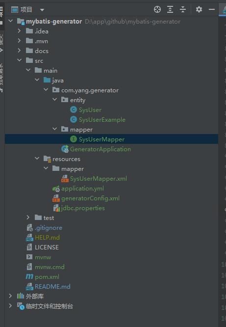

# mybatis-generator

MyBatis的代码生成器(MyBatis Generator)使用

> 参考: [https://www.jianshu.com/p/edb8428fa9df](https://www.jianshu.com/p/edb8428fa9df)
> 
> 官网: [http://mybatis.org/generator/index.html](http://mybatis.org/generator/index.html)


## mybatis generator

MyBatis Generator(MBG)是MyBatis的代码生成器。它将内省一个数据库表（或许多表），并将生成可用于访问表的工件, 这减少了设置对象和配置文件以与数据库表交互的初始麻烦

## 使用

- pom.xml中引入依赖

```
<!-- mybatis代码生成插件 -->
<plugin>
    <groupId>org.mybatis.generator</groupId>
    <artifactId>mybatis-generator-maven-plugin</artifactId>
    <version>1.4.0</version>
    <executions>
        <execution>
            <id>Generate MyBatis Artifacts</id>
            <goals>
                <goal>generate</goal>
            </goals>
        </execution>
    </executions>
    <configuration>
        <verbose>true</verbose>
        <overwrite>true</overwrite>
    </configuration>
    <dependencies>
        <dependency>
            <groupId>mysql</groupId>
            <artifactId>mysql-connector-java</artifactId>
            <version>8.0.11</version>
        </dependency>
    </dependencies>
</plugin>
```

- 创建文件generatorConfig.xml

在resources文件夹下创建文件generatorConfig.xml

```
<?xml version="1.0" encoding="UTF-8"?>
<!DOCTYPE generatorConfiguration
        PUBLIC "-//mybatis.org//DTD MyBatis Generator Configuration 1.0//EN"
        "http://mybatis.org/dtd/mybatis-generator-config_1_0.dtd">

<generatorConfiguration>

    <!-- 使用已有的配置文件 -->
    <properties resource="jdbc.properties"/>
    <!-- 数据库驱动 -->
<!--    <classPathEntry location="/Users/jiangyouhua/soft/mysql-connector-java-8.0.27.jar"/>-->

    <context id="DB2Tables" targetRuntime="MyBatis3">
        <!-- 数据库连接 -->
        <jdbcConnection driverClass="${spring.datasource.driver-class-name}"
                        connectionURL="${spring.datasource.url}"
                        userId="${spring.datasource.username}"
                        password="${spring.datasource.password}">
        </jdbcConnection>

        <!-- 非必须，类型处理器，在数据库类型和java类型之间的转换控制 -->
        <javaTypeResolver >
            <property name="forceBigDecimals" value="false" />
        </javaTypeResolver>

        <!-- Entity Java Class -->
        <javaModelGenerator targetPackage="com.yang.generator.entity" targetProject="./src/main/java">
            <property name="enableSubPackages" value="false" />
            <property name="trimStrings" value="true" />
        </javaModelGenerator>

        <!-- Mapper Java Class -->
        <sqlMapGenerator targetPackage="mapper"  targetProject="./src/main/resources">
            <property name="enableSubPackages" value="false" />
        </sqlMapGenerator>

        <!-- Mapper XML File -->
        <javaClientGenerator type="XMLMAPPER" targetPackage="com.yang.generator.mapper"  targetProject="./src/main/java">
            <property name="enableSubPackages" value="false" />
        </javaClientGenerator>

        <!-- 需要生成的数据库表 -->
        <table tableName="sys_user" domainObjectName="SysUser" enableCountByExample="false" enableDeleteByExample="false"
               enableSelectByExample="false" enableUpdateByExample="false">
        </table>

    </context>
</generatorConfiguration>
```

> - 修改数据连接信息
> - 修改Entity, Mapper, Mapper XML等文件包路径
> - 修改需要生成的数据库表

- 最后一步

在Maven标签里，找到Plugins/mybatis-generator/mybatis-generator.generate，双击运行后生成Entity、Mapper、Mapper.xml文件


创建完成



## 场景

#### 结合Lombok

使用已有的轮子MyBatis Generator Lombok plugin

- 修改pom.xml 放在generator插件标签

```
<plugin>
    <groupId>org.mybatis.generator</groupId>
    <artifactId>mybatis-generator-maven-plugin</artifactId>
    <version>1.4.0</version>
    ...
    <dependencies>
        <dependency>
            <groupId>com.softwareloop</groupId>
            <artifactId>mybatis-generator-lombok-plugin</artifactId>
            <version>1.0</version>
        </dependency>
    </dependencies>
</plugin>
```

- 修改generatorConfig.xml 放在<context>里

```
<plugin type="com.softwareloop.mybatis.generator.plugins.LombokPlugin">
    <!-- enable annotations -->
    <property name="builder" value="true"/>
    <!-- annotation's option(boolean) -->
    <property name="builder.fluent" value="true"/>
    <!-- annotation's option(String) -->
    <property name="builder.builderMethodName" value="myBuilder"/>
    <property name="accessors" value="true"/>
    <!-- annotation's option(array of String) -->
    <property name="accessors.prefix" value="m_, _"/>
    <!-- disable annotations -->
    <property name="allArgsConstructor" value="false"/>
</plugin>
```

> 注意: <context>标签顺序不匹配，应按照提示的顺序将标签依次排序

```
<property />
<plugin />
<commentGenerator />
<jdbcConnection/>
<javaTypeResolver/>
<javaModelGenerator/>
<sqlMapGenerator/>
<javaClientGenerator/>
<table/>
```
